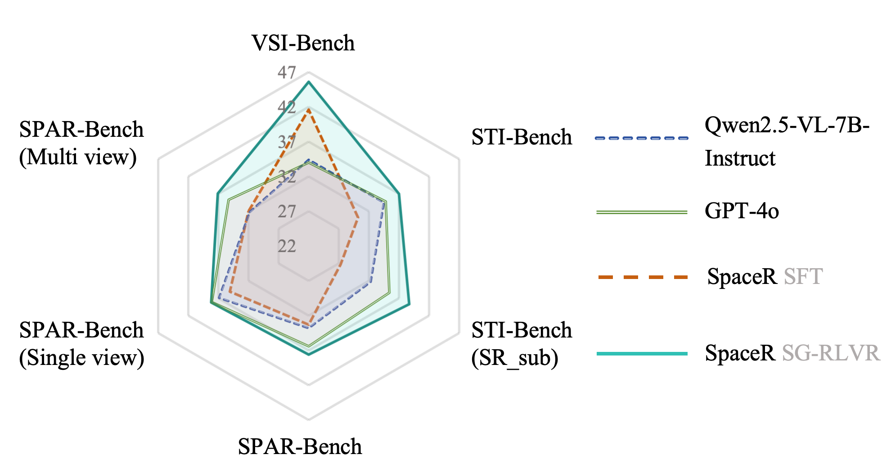

📅 News

🚀 [04/29/2025] We release [SR-91k](https://github.com/OuyangKun10/Spatial-R1/blob/main/annotation/SR-91k.jsonl) annotations.

🚀 [04/10/2025] We update the training framework of Sptial-r1, and release [Sptial-R1-exp-1500](https://huggingface.co/RUBBISHLIKE/Sptial-R1-exp-1500), which is trained on SR dataset (91k). 1500 means the training steps. We will release final model after finshing training process.

🚀 [04/07/2025] We release checkpoint of [Spatial-R1-tiny](https://huggingface.co/RUBBISHLIKE/Spatial-R1-tiny)

🚀 [04/02/2025] We share the draft version of Spatial-R1 on arxiv.

🚀 [03/31/2025] We release evluation and training code.


# Spatial-R1
The first MLLM trained using GRPO for spatial reasoning in videos

🏆 Performance Comparison 


**Data Statistics of Spatial-R1-151k**


**QA Examples of SR-91k**


We curate Spatial-R1-151k dataset and propose Spatial-R1. It achieves promising gains in VSI-Bench and STI-Bench. **Spatial-R1-Tiny** is trained on the tiny set of SR dataset, which contains 9k samples. **NOTE** We have excluded videos used in VSI-Bench to prevent data leakage.

## Training
```bash
git clone https://github.com/OuyangKun10/Spatial-R1.git
cd Spatial-R1/spatial-r1

# build environment
conda create -n spatial-r1 python=3.11 
conda activate spatial-r1
bash setup.sh

# qwen video extraction setting, e.g., max frames, resolutions
# Use the [decord] feature to improve speed
cd src/qwen-vl-utils
pip install -e .[decord]
cd ..
```
**Data Preparation**:
https://huggingface.co/datasets/RUBBISHLIKE/Spatial-R1-151k
1. Download [videos](https://huggingface.co/datasets/RUBBISHLIKE/Spatial-R1-151k) of SR-91k.

```bash
bash decompress.sh
```

2. Annotations 

   
**Training script for Spatial-r1**
```bash
bash ./src/scripts/run_grpo_video.sh
```
## Evaluation

## Setup

1.  **Environment:** Python 3.8+, CUDA-enabled GPUs.
2.  **Install Libraries:**
    ```bash
    pip install torch pandas numpy pillow accelerate transformers sentencepiece decord flash-attn --no-build-isolation
    ```
3.  **Dataset:** VSI-Bench `.parquet` file and corresponding `.mp4` video files.
4.  **Utilities:** Ensure `qwen_vl_utils.py`, `util.py`, `vsibench_acc.py` are accessible.

## Usage

1.  **Configure:** Edit parameters in the `if __name__ == "__main__":` block:
    *   `parquet_file`, `video_dir`, `output_dir_base`
    *   `model_name` (path or HF ID)
    *   `gpu_ids`, `num_processes`
    *   `num_frames`, `fps`, `target_resolution`, `batch_size`
    *   `SELECTED_PROMPT_TYPE`
    *   Cognitive map settings (`use_cognitive_map`, `offload_cogmap`, paths, keys)
    *   `debug_mode`, `debug_size`
2.  **Run:**
    ```bash
    python eval_qwen.py
    ```

## Output

*   **Results:** `output_dir/model_timestamp/vsibench_results_*.jsonl` (Detailed predictions and metadata).
*   **Logs:** `output_dir/model_timestamp/vsibench_eval_*.log` (Configuration, progress, timings, and final accuracy metrics).

The script automatically calculates and prints/logs overall and per-task accuracy upon completion.

We will release the final version of **SR** dataset after all work is done.

**Citation:**

```bash
@misc{ouyang2025spatialr1enhancingmllmsvideo,
      title={Spatial-R1: Enhancing MLLMs in Video Spatial Reasoning}, 
      author={Kun Ouyang},
      year={2025},
      eprint={2504.01805},
      archivePrefix={arXiv},
      primaryClass={cs.CV},
      url={https://arxiv.org/abs/2504.01805}, 
}
```

