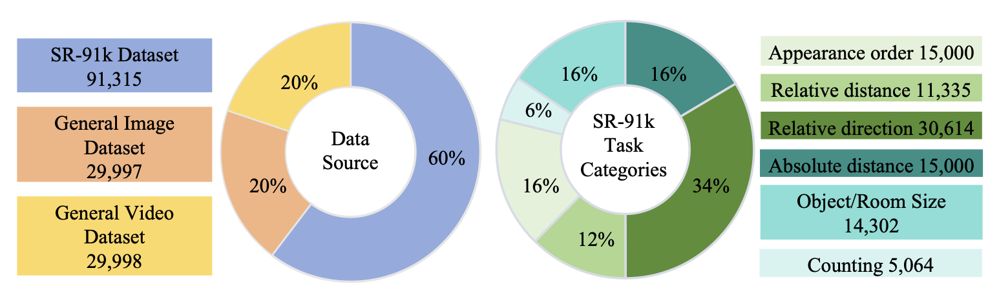

# <div style="text-align: center;"> </div>
# SpaceR: Reinforcing MLLMs in Video Spatial Reasoning  
[📖 Paper](https://github.com/OuyangKun10/SpaceR/blob/main/SpaceR_Preprint.pdf) [🤗 SpaceR](https://huggingface.co/RUBBISHLIKE/SpaceR) [🤗 SpaceR-151k](https://huggingface.co/datasets/RUBBISHLIKE/SpaceR-151k)


📅 News

🚀 [05/19/2025] We release [SpaceR-151k](https://huggingface.co/datasets/RUBBISHLIKE/SpaceR-151k) dataset.

🚀 [05/10/2025] We release [SpaceR](https://huggingface.co/RUBBISHLIKE/SpaceR) checkpoint.

🚀 [04/29/2025] We release [SR-91k](https://huggingface.co/datasets/RUBBISHLIKE/SpaceR-151k) dataset.

🚀 [04/10/2025] We update the training framework of SpaceR.

🚀 [04/02/2025] We share the draft version of SpaceR on arxiv.

🚀 [03/31/2025] We release evluation and training code.


# SpaceR
The first MLLM empowered by SG-RLVR for video spatial reasoning

🏆 Performance Comparison 


**Data Statistics of SpaceR-151k**


**QA Examples of SR-91k**


We curate SpaceR-151k dataset and propose SpaceR. It achieves promising gains in VSI-Bench, SPAR-Bench and STI-Bench.  **NOTE** We have excluded [videos](https://github.com/OuyangKun10/SpaceR/blob/main/exclude_list.txt) used in VSI-Bench to prevent data leakage.

## Training
```bash
git clone https://github.com/OuyangKun10/SpaceR.git
cd SpaceR/SpaceR

# build environment
conda create -n SpaceR python=3.11 
conda activate SpaceR
bash setup.sh

# qwen video extraction setting, e.g., max frames, resolutions
# Use the [decord] feature to improve speed
cd src/qwen-vl-utils
pip install -e .[decord]
cd ..
```
**Data Preparation**:

1. Download [SpaceR-151k dataset](https://huggingface.co/datasets/RUBBISHLIKE/SpaceR-151k).

2. Decompress it
   
```bash
bash decompress.sh
```

   
**Training script for SpaceR**
```bash
bash ./src/scripts/run_SpaceR_SG_RLVR.sh
```
## Evaluation

**SpaceR-Eval**

## Setup

1.  **Environment:** Python 3.8+, CUDA-enabled GPUs.
2.  **Install Libraries:**
    ```bash
    pip install torch pandas numpy pillow accelerate transformers sentencepiece decord flash-attn --no-build-isolation
    ```
3.  **Dataset:** VSI-Bench STI-Bench, SPAR-Bench, Video-MME, TempCompass, LongVideoBench


## Usage
    ```bash
    python evaluate.py
    ```

**Citation:**

```bash
@article{ouyang2025spatialr1enhancingmllmsvideo,
      title={Spatial-R1: Enhancing MLLMs in Video Spatial Reasoning}, 
      author={Kun Ouyang},
      year={2025},
      eprint={2504.01805},
      archivePrefix={arXiv},
      primaryClass={cs.CV},
      url={https://arxiv.org/abs/2504.01805}, 
}
```

## License
* The code in this repo is released under the [CC BY-NC 4.0](https://github.com/OuyangKun10/SpaceR/blob/main/LICENSE) License. 
* The usage of SpaceR-151k dataset and SpaceR model weights must strictly follow [CC BY-NC 4.0](https://github.com/OuyangKun10/SpaceR/blob/main/LICENSE) License. 


